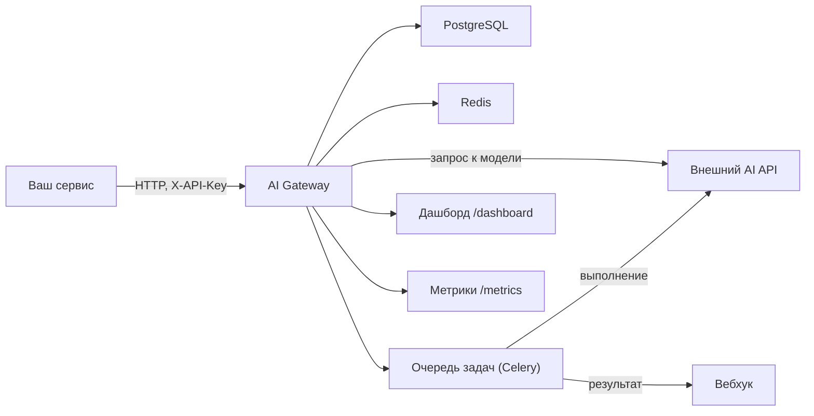

# AI Gateway

Шлюз между твоими сервисами и внешними AI‑провайдерами (OpenAI/OpenRouter и аналоги).
Даёт один стабильный HTTP API и полезную обвязку вокруг: ключи клиентов, лимиты, бюджеты, очередь задач, аудит, учёт стоимости и вебхуки.

## Зачем это нужно

- один вход для всех приложений (бот, админка, бекенд), вместо прямых интеграций в каждом;
- можно менять провайдера/модель без переписывания клиентов;
- контроль расходов и защита от “случайно сожгли бюджет”;
- асинхронные задачи: тяжёлое уезжает в воркер, результат можно доставить на вебхук.

## Технический стек

- Python 3.11+
- FastAPI + Uvicorn
- Pydantic v2 + pydantic-settings
- httpx
- PostgreSQL + SQLAlchemy 2 + Alembic
- Redis
- Celery
- Prometheus метрики (`/metrics`)
- Structlog (логи)
- Jinja2 (мини‑дашборд `/dashboard`)
- Docker + docker compose

## Как это устроено



## Что умеет

- `POST /v1/responses` — основной синхронный запрос к модели (совместимо с OpenAI Responses API).
- `POST /v1/chat/completions` — совместимость со старым форматом (без стриминга).
- `GET /v1/models` — список моделей (для внешнего провайдера проксируем `/v1/models`, кэшируем в Redis).
- Асинхронка:
  - `POST /v1/jobs` — поставить задачу в очередь
  - `GET /v1/jobs/{id}` — статус/результат
  - опционально: доставка результата на вебхук
- Клиентские ключи (`X-API-Key`), лимиты и бюджеты.
- PostgreSQL: ключи, бюджеты, аудит.
- Redis: лимиты, кэш моделей, очередь для Celery.
- `/metrics`, `/healthz`, `/readyz`
- `/dashboard` (логин/пароль) и документация API: `/docs`

Есть `MockProvider`, чтобы всё запускалось локально без внешних ключей.

## Быстрый старт (локально, через Docker)

1) Поднять инфраструктуру:
   
   ```bash
   docker compose up -d --build
   ```

2) Применить миграции:
   
   ```bash
   docker compose run --rm api alembic upgrade head
   ```

3) Создать клиентский ключ (показывается один раз):
   
   ```bash
   docker compose run --rm api ai-gateway create-key --name local
   ```
   
   Формат нового ключа: `agw_<id>.<secret>` (старые ключи без точки тоже принимаются, но медленнее).

4) Проверка:
   
   - `GET http://localhost:8010/healthz`
   - `GET http://localhost:8010/readyz`
   - `GET http://localhost:8010/docs`
   - `GET http://localhost:8010/dashboard` (логин/пароль из `.env`)

Пример `POST /v1/responses` (mock):

```bash
curl -s http://localhost:8010/v1/responses \
  -H "Content-Type: application/json" \
  -H "X-API-Key: <ВАШ_КЛЮЧ>" \
  -d '{"model":"mock-1","input":"Привет, расскажи анекдот"}'
```

Пример асинхронной задачи:

```bash
curl -s http://localhost:8010/v1/jobs \
  -H "Content-Type: application/json" \
  -H "X-API-Key: <ВАШ_КЛЮЧ>" \
  -d '{"kind":"responses","payload":{"model":"mock-1","input":"Hello from job"}}'
```

## Подключение внешнего провайдера (OpenAI / OpenRouter и аналоги)

В `.env`:

- `DEFAULT_PROVIDER=openai`
- `OPENAI_BASE_URL` (можно с `/v1` или без)
- `OPENAI_API_KEY`
- опционально (полезно для OpenRouter): `OPENAI_HTTP_REFERER`, `OPENAI_TITLE`

Для `/v1/responses` шлюз по умолчанию подставляет `store=false`, если поле не задано (безопасный дефолт).

## Безопасность и данные

- в БД по умолчанию пишем метаданные и “обезличенные” данные запроса (редакция ключей/токенов), а не полный текст запросов/ответов;
- секреты держим в `.env`, в репо хранится только `.env.example`.
